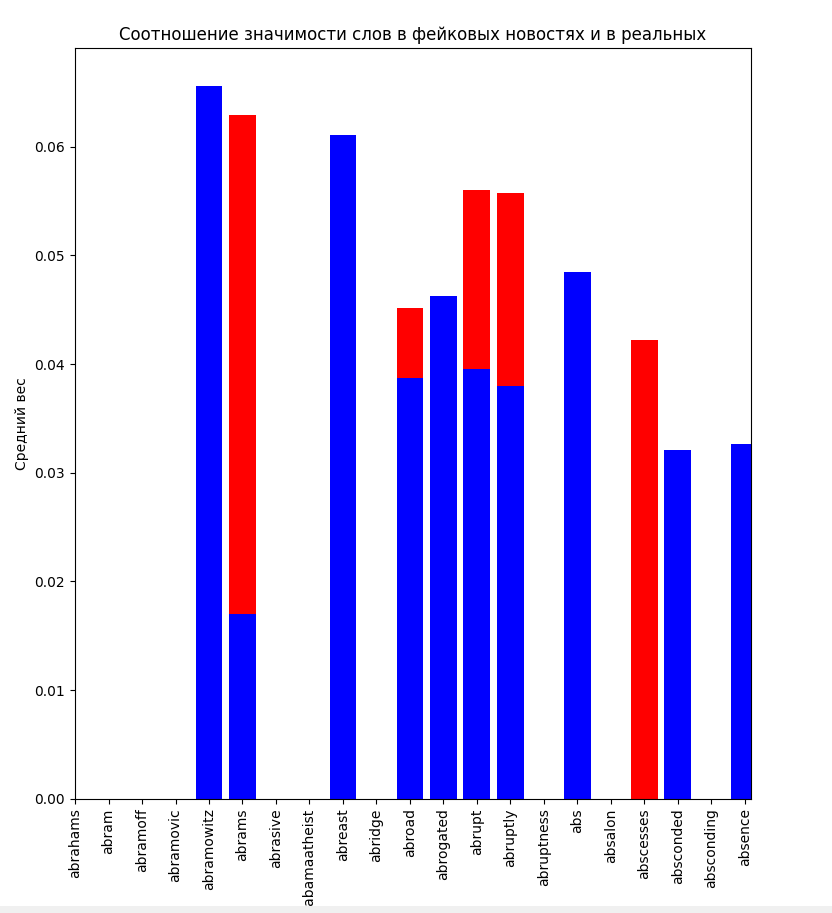
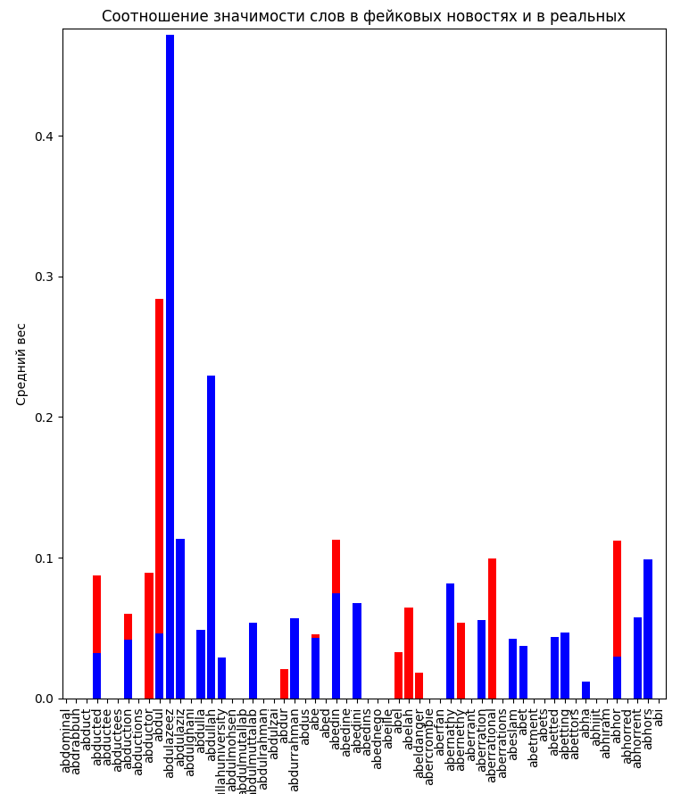
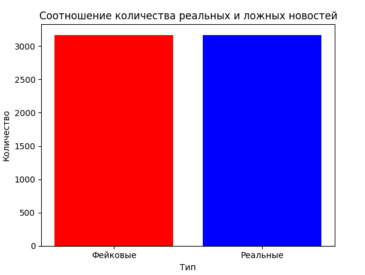
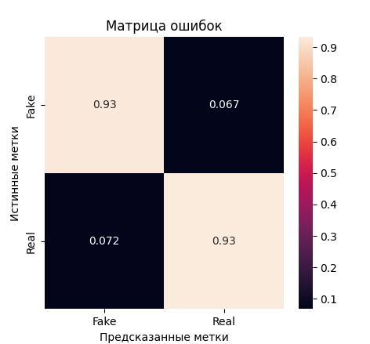
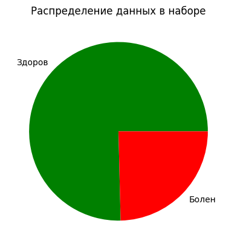
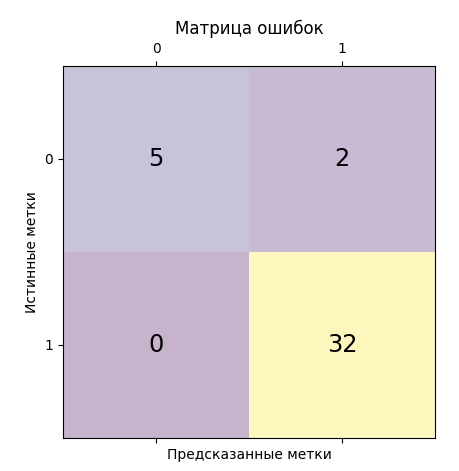
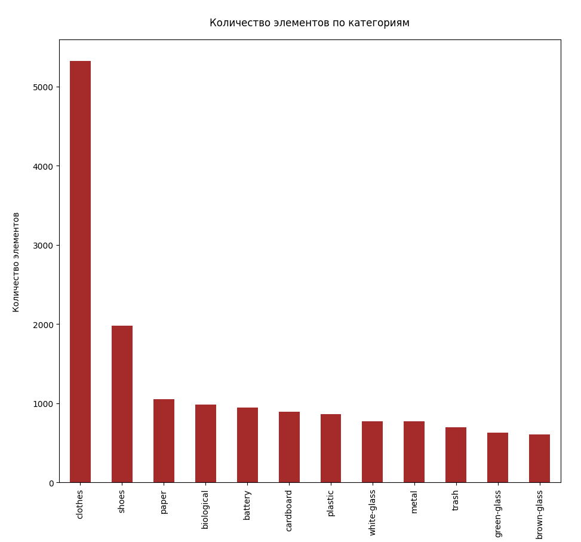
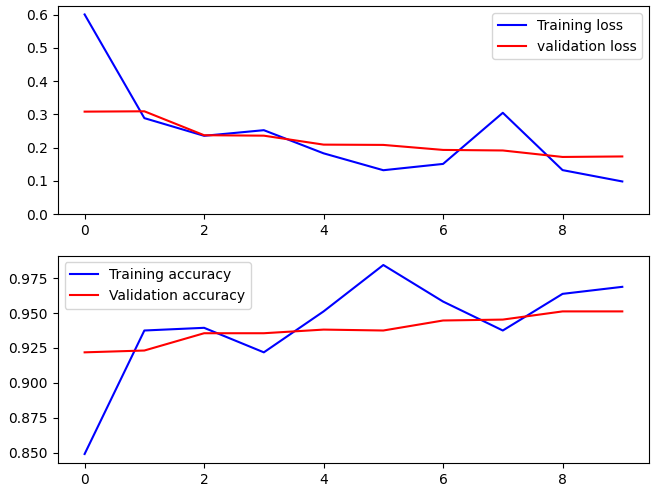
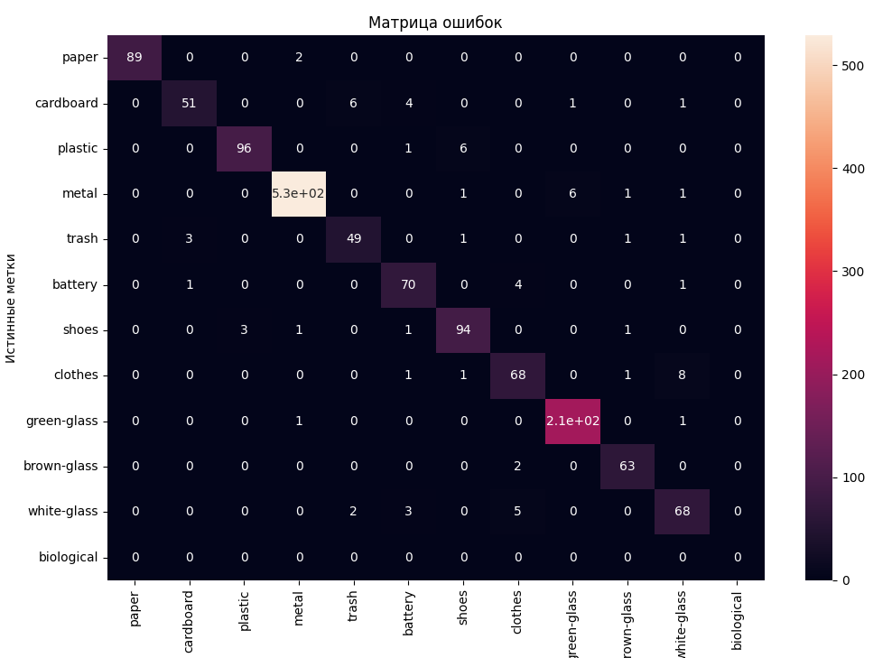
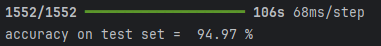

<h1>Практическая работа №1</h1>
<h2>Задача 1</h2>

 Создать модель ИИ, с 90% точностью определяющая фейковые новости.

 Инструменты: Python 3.12, sklearn, TfidfVectorizer, PassiveAggressiveClassifier 
 Для обучения модели применён инструмент TfidVectorizer так
как необходимо преобразование текстовых данных в численные признаки для 
обучения модели. Была выявлена зависимость: есть такие ключевые слова, имеющие 
большой вес в реальных новостях и низкий вес в фейковых, и наоборот.  

|||
|-------|--------|
| | |

Данные в наборе распределены равномерно 
 
Полученная модель имеет точность - 93.05%  
 

<h2>Задача 2</h2>

 Создать модель ИИ, с 95% точностью определяющая заболевание Паркинсона.

Инструменты: Python 3.12, sklearn, XGBClassifier 

 
Полученная модель имеет точность - 94.87%  
 

<h2>Задача 3</h2>

 Создать модель ИИ, классифицирующая отходы по фотографии.

Инструменты: Python 3.12, sklearn, keras, tensorflow, ImageGenerator, Xception 

| Распределение данных                                                         | Примеры элементов набора данных |
|------------------------------------------------------------------------------|----------------------------|
 |  | |
 | Ошибка перекрёстной энтропии от эпохи                                        | Полученная матрица ошибок|
 |          ||

Полученная модель имеет точность ~95%  
 

